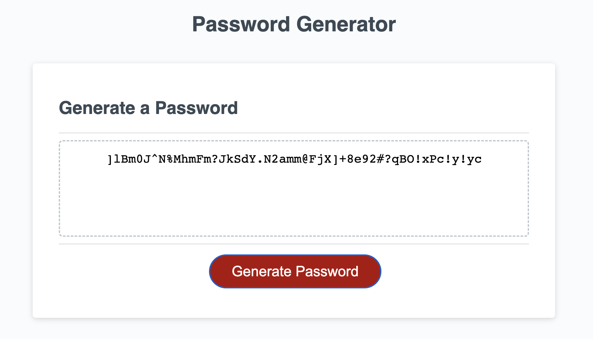

# Password Generator

## The Task:

* I have been tasked with creating Javascript code to generate a random password from a specific set of characters. The password must be more than 10 but no more than 64 characters in lenght.

**Instructions**

* Generate a password when the button is clicked
  * Present a series of prompts for password criteria
    * Length of password
      * At least 10 characters but no more than 64.
    * Character types
      * Lowercase
      * Uppercase
      * Numeric
      * Special characters ($@%&*, etc)
  * Code should validate for each input and at least one character type should be selected
  * Once prompts are answered then the password should be generated and displayed in an alert or written to the page

## Installation

To run, simply open the following link in your Chrome web browser. Once open, enter a number between 10-64, and select from the following options to include specific characters in your randomly generated password:

• Lowercase characters
• Uppercase characters
• numeric characters
• special symbols

Once you have selected the options you require, the password will be displayed on the screen. To start the process again, refresh your browser and continue as before.

Password Generator: https://shaky411.github.io/Password-Generator

## Usage

## Screenshots

## Credits

N/A

## License

Please refer to the license in the repo.
